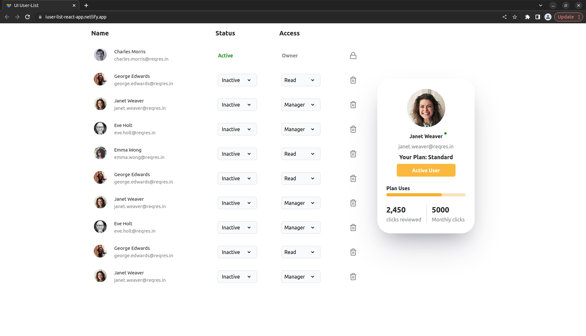

# User list app - UI

## Practical-4

- Create a dummy project named “user-list-react-app” in react using any of the above methods - CRA or webpack from scratch.
- The card on the right is the card that will appear on hovering over a user. This card will be containing details of the user which we hovered over.
- Use static dummy data for the user list for now.
- The user in the first row should have “Active” as status and “owner” as access in the list always, with a lock sign icon instead of a dust bin icon.

## 🚀 Live Demonstraion

- [User list app](https://iuser-list-react-app.netlify.app/)

## Setup Project Environment

- install all packages

  > ` npm install` :

- write below command
  > `npm run dev` : Start project on default Port
  >
  > - running npm run dev will start a development server that serves the Vite application and watches for changes to the code.
  > - Specifically, npm run dev will run the vite command with the --mode development option, which starts a development server that uses the Vite build tool to serve the application.
  > - As you make changes to the code, Vite will detect those changes and automatically rebuild and reload the application in the browser. Vite uses a fast and efficient development server that leverages browser-native ES modules to avoid expensive transpilation and bundling steps during development, which makes it faster and more responsive than many other development servers.

## External dependencies used in this project

- `@ramonak/react-progress-bar` : It is a React component library that provides a customizable and animated progress bar. It can be installed via npm by running npm install @ramonak/react-progress-bar.

- `react-feather` : React Feather is a set of Feather icons, packaged as a set of React components. These icons are open source, beautifully crafted, and easy to use. React Feather provides a wide range of icons, covering many use cases such as general purpose, social media, file types, and more. To use React Feather, you can simply install it as a dependency in your React project using npm or yarn, and then import and use the icons in your components.

- `react-bootstrap` : It is a popular UI library that provides pre-built components and styles for building responsive and mobile-first web applications in React. It includes a wide range of UI components such as buttons, forms, modals, navbars, tables, and more, all styled with Bootstrap CSS.

## Here are some of the prebuilt devDependencies that are preinstalled when we create react project using vite with Typescript+SWC.

## devDependencies

- `@typescript-eslint/eslint-plugin` : The @typescript-eslint/eslint-plugin is a plugin for ESLint, which provides linting rules for TypeScript code. It uses the TypeScript compiler to analyze the code and provide type-checking, and can catch many common errors and mistakes that may be missed by a regular JavaScript linter.

- `@typescript-eslint/parser` : It is a parser for ESLint that allows it to lint TypeScript code. It converts TypeScript code into an Abstract Syntax Tree (AST) that ESLint can work with. The parser is used in conjunction with the @typescript-eslint/eslint-plugin plugin, which provides additional rules for TypeScript-specific syntax.

- Using `@typescript-eslint/parser` and `@typescript-eslint/eslint-plugin` can help ensure that your TypeScript code is following best practices and is free of potential errors or issues.

- `@vitejs/plugin-react-swc` : It is a Vite plugin that enables the use of SWC (a fast JavaScript/TypeScript compiler) to transform React JSX and TypeScript files. SWC is known to be faster than Babel, which is commonly used for these transformations, and can lead to faster build times. This plugin can be added to a Vite project by installing it as a dependency and adding it to the Vite config file.

- `eslint-plugin-react-hooks` : It is a plugin for ESLint that provides linting rules to ensure that React Hooks are used correctly. It checks for common mistakes like calling hooks inside loops or conditions, or not calling hooks at the top level of a component function. The plugin helps enforce the rules of the React Hooks API, which is a set of functions that allow you to use state and other React features in functional components.

- `eslint-plugin-react-refresh` : It is a plugin for ESLint that provides linting rules for the `react-refresh` Babel plugin. `react-refresh` is a tool that allows React components to be reloaded without losing their state, making development faster and more efficient. The eslint-plugin-react-refresh plugin provides rules to ensure that the `react-refresh` Babel plugin is used correctly in your code.

## Screenshot

